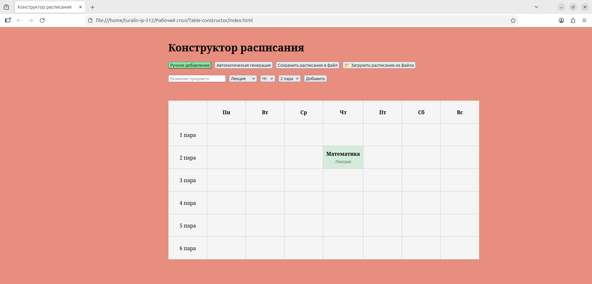
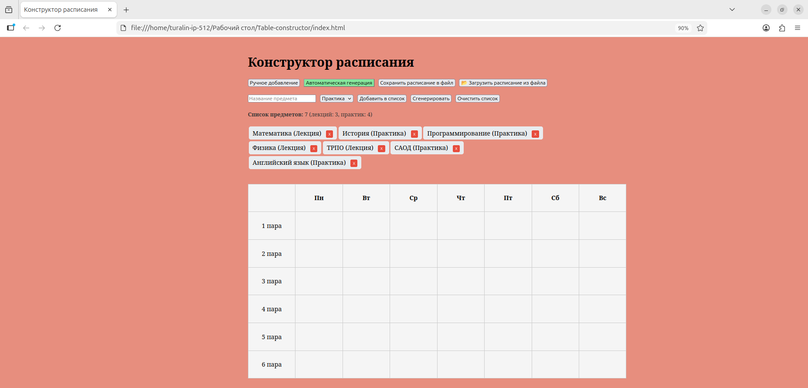
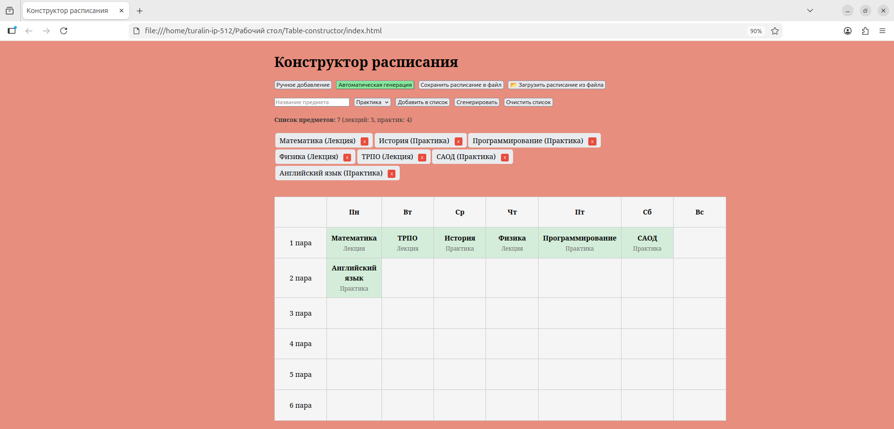

# Конструктор учебного расписания

Веб-приложение для составления недельного расписания занятий. Поддерживает ручное добавление предметов и автоматическую генерацию с учётом заданных правил.

## Возможности

- **Ручной режим:** добавить предмет в конкретный день и на конкретную пару
- **Автоматический режим:** генерация расписания из списка предметов
- **Правила генерации:** не более 3 пар в день, воскресенье — выходной
- **Управление списком:** добавить, удалить отдельный предмет, очистить весь список
- **Экспорт:** сохранение расписания в файл и загрузка из файла
- **Тесты:** модульные тесты алгоритма генерации (Jest)

## Скриншоты

### Ручной режим


### Автоматический режим


### Сгенерированное расписание


## Технологический стек

| Слой | Технология |
|------|------------|
| Структура | HTML5 |
| Стили | CSS3 (Flexbox) |
| Логика | JavaScript (ES6+) |
| Тестирование | Jest |
| Контроль версий | Git, GitHub |

## Инструкция по запуску

### 1. Клонирование репозитория

```bash
git clone https://github.com/TuralinIP512/Table-constructor.git
cd Table-constructor

2. Запуск приложения
Открыть index.html в браузере:

bash
# Linux
xdg-open index.html

# macOS
open index.html

# Windows
start index.html

3. Запуск тестов
bash
npm install        # установить Jest (один раз)
npm test           # запустить тесты

Статус проекта
✅ Стабильная версия.

Автор
Туралин_А.С. 